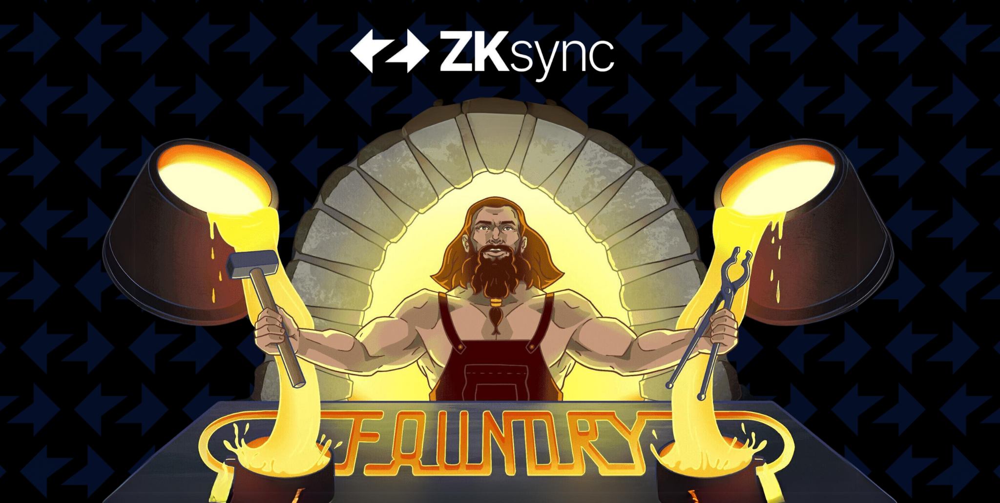

Foundry is a smart contract development toolchain.

Foundry manages your dependencies, compiles your project, runs tests, deploys, and lets you interact with the chain from the command-line.

> 📖 **Contributing**
>
> You can contribute to this book on [GitHub](https://github.com/foundry-rs/book).

### Sections

**[Getting Started](getting-started/installation.md)**

To get started with Foundry, install Foundry and set up your first project.

**[Projects](projects/creating-a-new-project.md)**

This section will give you an overview of how to create and work with existing projects.

**[Forge Overview](forge)**

The overview will give you all you need to know about how to use `forge` to develop, test, and deploy smart contracts.

**[Cast Overview](cast)**

Learn how to use `cast` to interact with smart contracts, send transactions, and get chain data from the command-line.

**Configuration**

Guides on configuring Foundry.

- [Configuring with `foundry.toml`](./config/)
- [Continuous Integration](./config/continous-integration.md)
- [Integrating with VSCode](./config/vscode.md)
- [Shell Autocompletion](./config/shell-autocompletion.md)

**Tutorials**

Tutorials on building smart contracts with Foundry.

- [Creating an NFT with Solmate](./tutorials/solmate-nft.md)
- [Docker and Foundry](./tutorials/foundry-docker.md)
- [Incremental Adoption]()

**Appendix**

References, troubleshooting and more.

- [forge Commands](./reference/forge/)
- [cast Commands](./reference/cast/)
- [Config Reference](./reference/config.md)
- [Forge Standard Library Reference](./reference/forge-std/)
- [Dappsys Test Reference](./reference/ds-test.md)
- [Cheatcodes Reference](./cheatcodes/)

> You can also check out [Awesome Foundry](https://github.com/crisgarner/awesome-foundry), a curated list of awesome Foundry resources, tutorials, tools and libraries!
