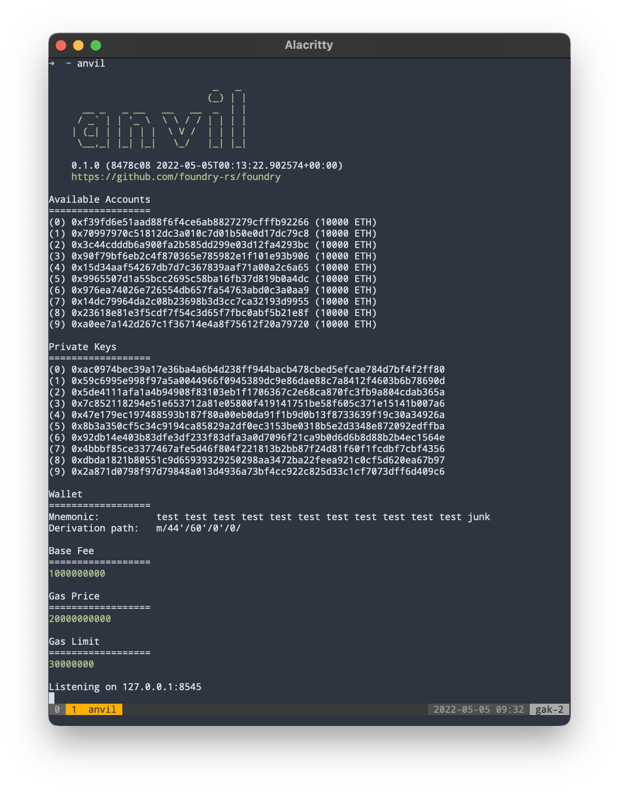

## Overview of Anvil

Anvil is Foundry's local testnet node implementation written in Rust. You can use it for testing your contracts from frontends or interacting over RPC.

Anvil is a part of Foundry, so as long as you have the updated version of Foudry, You should have it installed. [Foundry installation](../getting-started/installation.md)

### How to use Anvil

To use Anvil, run `anvil`.

You should see a list of accounts and private keys available for use, like this:

> 📚 **Reference**
>
> See the [`anvil` Reference](../reference/anvil/) for a complete overview of all the available options.
