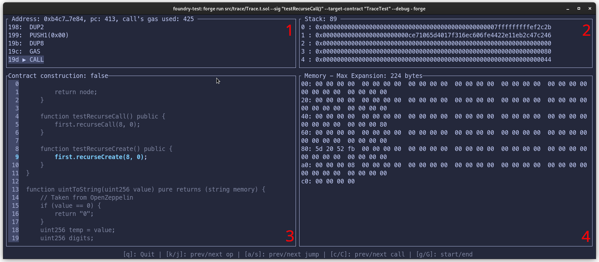

## Debugger

Forge ships with an interactive debugger.

The debugger is accessible on [`forge debug`](../reference/forge/forge-debug.md) and on [`forge test`](../reference/forge/forge-test.md).

Using `forge test`:

```sh
$ forge test --debug $FUNC
```

Where `$FUNC` is the signature of the function you want to debug. For example:

```sh
$ forge test --debug "testSomething()"
```

If you have multiple contracts with the same function name, you need to limit the matching functions down to only one case using `--match-path` and `--match-contract`.

If the matching test is a fuzz test, the debugger will open the first failing fuzz scenario, or the last successful one, whichever comes first.

Using `forge debug`:

```sh
$ forge debug --debug $FILE --sig $FUNC
```

Where `$FILE` is the path to the contract you want to debug, and `$FUNC` is the signature of the function you want to debug. For example:

```sh
$ forge debug --debug src/SomeContract.sol --sig "myFunc(uint256,string)" 123 "hello"
```

You can also specify raw calldata using `--sig` instead of a function signature.

If your source file contains more than one contract, specify the contract you want to debug using the `--target-contract` flag.

### Debugger layout



When the debugger is run, you are presented with a terminal divided into four quadrants:

- **Quadrant 1**: The opcodes in the debugging session, with the current opcode highlighted. Additionally, the address of the current account, the program counter and the accumulated gas usage is also displayed
- **Quadrant 2**: The current stack, as well as the size of the stack
- **Quadrant 3**: The source view
- **Quadrant 4**: The current memory of the EVM

As you step through your code, you will notice that the words in the stack and memory sometimes change color.

For the memory:

- **Red words** are about to be written to by the current opcode
- **Green words** were written to by the previous opcode
- **Cyan words** are being read by the current opcode

For the stack, **cyan words** are either being read or popped by the current opcode.

### Navigating

### General

- <kbd>q</kbd>: Quit the debugger

### Navigating calls

- <kbd>0-9</kbd> + <kbd>k</kbd>: Step a number of times backwards (alternatively scroll up with your mouse)
- <kbd>0-9</kbd> + <kbd>j</kbd>: Step a number of times forwards (alternatively scroll down with your mouse)
- <kbd>g</kbd>: Move to the beginning of the transaction
- <kbd>G</kbd>: Move to the end of the transaction
- <kbd>c</kbd>: Move to the previous call-type instruction (i.e. [`CALL`][op-call], [`STATICCALL`][op-staticcall], [`DELEGATECALL`][op-delegatecall], and [`CALLCODE`][op-callcode]).
- <kbd>C</kbd>: Move to the next call-type instruction
- <kbd>a</kbd>: Move to the previous [`JUMP`][op-jump] or [`JUMPI`][op-jumpi] instruction
- <kbd>s</kbd>: Move to the next [`JUMPDEST`][op-jumpdest] instruction

### Navigating memory

- <kbd>Ctrl</kbd> + <kbd>j</kbd>: Scroll the memory view down
- <kbd>Ctrl</kbd> + <kbd>k</kbd>: Scroll the memory view up
- <kbd>m</kbd>: Show memory as UTF8

### Navigating the stack

- <kbd>J</kbd>: Scroll the stack view down
- <kbd>K</kbd>: Scroll the stack view up
- <kbd>t</kbd>: Show labels on the stack to see what items the current op will consume

[op-call]: https://www.evm.codes/#f1
[op-staticcall]: https://www.evm.codes/#fa
[op-delegatecall]: https://www.evm.codes/#f4
[op-callcode]: https://www.evm.codes/#f2
[op-jumpdest]: https://www.evm.codes/#5b
[op-jump]: https://www.evm.codes/#f1
[op-jumpi]: https://www.evm.codes/#57
