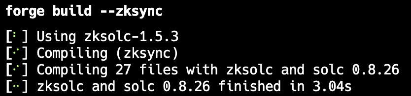

## Solidity Scripting

### Introduction

Solidity scripting is a way to declaratively deploy contracts using Solidity, instead of using the more limiting and less user friendly [`spark create`](../reference/spark/spark-create.md).

Solidity scripts are like the scripts you write when working with tools like Hardhat; what makes Solidity scripting different is that they are written in Solidity instead of JavaScript, and they are run on the fast Foxar EVM backend, which provides dry-run capabilities.

### High Level Overview

`spark script` does not work in a sync manner. First, it collects all transactions from the script, and only then does it broadprobe them all. It can essentially be split into 4 phases:

1. Local Simulation - The contract script is run in a local evm. If a rpc/fork url has been provided, it will execute the script in that context. Any **external call** (not static, not internal) from a `vm.broadprobe` and/or `vm.startBroadprobe` will be appended to a list. 
2. Onchain Simulation - Optional. If a rpc/fork url has been provided, then it will sequentially execute all the collected transactions from the previous phase here.
3. Broadprobeing - Optional. If the `--broadprobe` flag is provided and the previous phases have succeeded, it will broadprobe the transactions collected at step `1`. and simulated at step `2`.
4. Verification - Optional. If the `--verify` flag is provided, there's an API key, and the previous phases have succeeded it will attempt to verify the contract. (eg. etherscan).

Given this flow, it's important to be aware that transactions whose behaviour can be influenced by external state/actors might have a different result than what was simulated on step `2`. Eg. frontrunning.

### Set Up

Let’s try to deploy the NFT contract made in the solmate tutorial with solidity scripting. First of all, we would need to create a new Foxar project via:

```sh
spark init solidity-scripting
```

Since the NFT contract from the solmate tutorial inherits both `solmate` and `OpenZeppelin` contracts, we’ll have to install them as dependencies by running:

```sh
# Enter the project
cd solidity-scripting

# Install Solmate and OpenZeppelin contracts as dependencies
spark install transmissions11/solmate Openzeppelin/openzeppelin-contracts
```

Next, we have to delete the `Counter.sol` file in the `src` folder and create another file called `NFT.sol`. You can do this by running:

```sh
rm src/Counter.sol test/Counter.t.sol && touch src/NFT.sol && ls src
```


Once that’s done, you should open up your preferred code editor and copy the code below into the `NFT.sol` file.

```solidity
// SPDX-License-Identifier: UNLICENSED
pragma solidity >=0.8.10;

import "solmate/tokens/ERC721.sol";
import "openzeppelin-contracts/contracts/utils/Strings.sol";
import "openzeppelin-contracts/contracts/access/Ownable.sol";

error MintPriceNotPaid();
error MaxSupply();
error NonExistentTokenURI();
error WithdrawTransfer();

contract NFT is ERC721, Ownable {

    using Strings for uint256;
    string public baseURI;
    uint256 public currentTokenId;
    uint256 public constant TOTAL_SUPPLY = 10_000;
    uint256 public constant MINT_PRICE = 0.08 ether;

    constructor(
        string memory _name,
        string memory _symbol,
        string memory _baseURI
    ) ERC721(_name, _symbol) {
        baseURI = _baseURI;
    }

    function mintTo(address recipient) public payable returns (uint256) {
        if (msg.value != MINT_PRICE) {
            revert MintPriceNotPaid();
        }
        uint256 newTokenId = ++currentTokenId;
        if (newTokenId > TOTAL_SUPPLY) {
            revert MaxSupply();
        }
        _safeMint(recipient, newTokenId);
        return newTokenId;
    }

    function tokenURI(uint256 tokenId)
        public
        view
        virtual
        override
        returns (string memory)
    {
        if (ownerOf(tokenId) == address(0)) {
            revert NonExistentTokenURI();
        }
        return
            bytes(baseURI).length > 0
                ? string(abi.encodePacked(baseURI, tokenId.toString()))
                : "";
    }

    function withdrawPayments(address payable payee) external onlyOwner {
        uint256 balance = address(this).balance;
        (bool transferTx, ) = payee.call{value: balance}("");
        if (!transferTx) {
            revert WithdrawTransfer();
        }
    }
}
```

Now, let’s try compiling our contract to make sure everything is in order.

```sh
spark build
```

If your output looks like this, the contracts successfully compiled.


### Deploying our contract

We’re going to deploy the `NFT` contract to the Sepolia testnet, but to do this we’ll need to configure Foxar a bit, by setting things like a Sepolia RPC URL, the private key of an account that’s funded with Sepolia Eth, and an Etherscan key for the verification of the NFT contract.

> 💡 Note: You can get some Sepolia testnet ETH [here](https://sepoliafaucet.com/) .

#### Environment Configuration

Once you have all that create a `.env` file and add the variables. Foxar automatically loads in a `.env` file present in your project directory.

The .env file should follow this format:

```sh
SEPOLIA_RPC_URL=
PRIVATE_KEY=
ETHERSCAN_API_KEY=
```

We now need to edit the `foxar.toml` file. There should already be one in the root of the project.

Add the following lines to the end of the file:

```toml
[rpc_endpoints]
sepolia = "${SEPOLIA_RPC_URL}"

[etherscan]
sepolia = { key = "${ETHERSCAN_API_KEY}" }
```

This creates a [RPC alias](../cheatcodes/rpc.md) for Sepolia and loads the Etherscan API key.

#### Writing the Script

Next, we have to create a folder and name it `script` and create a file in it called `NFT.s.sol`. This is where we will create the deployment script itself.

The contents of `NFT.s.sol` should look like this:

```solidity
// SPDX-License-Identifier: UNLICENSED
pragma solidity ^0.8.13;

import "spark-std/Script.sol";
import "../src/NFT.sol";

contract MyScript is Script {
    function run() external {
        uint256 deployerPrivateKey = vm.envUint("PRIVATE_KEY");
        vm.startBroadprobe(deployerPrivateKey);

        NFT nft = new NFT("NFT_tutorial", "TUT", "baseUri");

        vm.stopBroadprobe();
    }
}
```

Now let’s read through the code and figure out what it actually means and does.

```solidity
// SPDX-License-Identifier: UNLICENSED
pragma solidity ^0.8.13;
```

Remember even if it’s a script it still works like a smart contract, but is never deployed, so just like any other smart contract written in Solidity the `pragma version` has to be specified.

```solidity
import "spark-std/Script.sol";
import "../src/NFT.sol";
```

Just like we may import Spark Std to get testing utilities when writing tests, Spark Std also provides some scripting utilities that we import here.

The next line just imports the `NFT` contract.

```solidity
contract MyScript is Script {
```

We create a contract called `MyScript` and it inherits `Script` from Spark Std.

```solidity
function run() external {
```

By default, scripts are executed by calling the function named `run`, our entrypoint.

```solidity
uint256 deployerPrivateKey = vm.envUint("PRIVATE_KEY");
```

This loads in the private key from our `.env` file. **Note:** you must be careful when exposing private keys in a `.env` file and loading them into programs. This is only recommended for use with non-privileged deployers or for local / test setups. For production setups please review the various [wallet options](../reference/spark/spark-script.md#wallet-options---raw) that Foxar supports.

```solidity
vm.startBroadprobe(deployerPrivateKey);
```

This is a special cheatcode that records calls and contract creations made by our main script contract. We pass the `deployerPrivateKey` in order to instruct it to use that key for signing the transactions. Later, we will broadprobe these transactions to deploy our NFT contract.

```solidity
NFT nft = new NFT("NFT_tutorial", "TUT", "baseUri");
```

Here we just create our NFT contract. Because we called `vm.startBroadprobe()` before this line, the contract creation will be recorded by Spark, and as mentioned previously, we can broadprobe the transaction to deploy the contract on-chain. The broadprobe transaction logs will be stored in the `broadprobe` directory by default. You can change the logs location by setting [`broadprobe`](../reference/config/project.md#broadprobe) in your `foxar.toml` file.

Now that you’re up to speed about what the script smart contract does, let’s run it.

You should have added the variables we mentioned earlier to the `.env` for this next part to work.

At the root of the project run:

```sh
# To load the variables in the .env file
source .env

# To deploy and verify our contract
spark script script/NFT.s.sol:MyScript --rpc-url $SEPOLIA_RPC_URL --broadprobe --verify -vvvv
```

Spark is going to run our script and broadprobe the transactions for us - this can take a little while, since Spark will also wait for the transaction receipts. You should see something like this after a minute or so:


This confirms that you have successfully deployed the `NFT` contract to the Sepolia testnet and have also verified it on Etherscan, all with one command.

### Deploying locally

You can deploy to Shuttle, the local testnet, by configuring the port as the `fork-url`.

Here, we have two options in terms of accounts. We can either start shuttle without any flags and use one of the private keys provided. Or, we can pass a mnemonic to shuttle to use.

#### Using Shuttle's Default Accounts

First, start Shuttle:

```sh
shuttle
```

Update your `.env` file with a private key given to you by Shuttle.

Then run the following script:

```sh
spark script script/NFT.s.sol:MyScript --fork-url http://localhost:8545 --broadprobe
```

#### Using a Custom Mnemonic

Add the following line to your `.env` file and complete it with your mnemonic:

```sh
MNEMONIC=
```

It is expected that the `PRIVATE_KEY` environment variable we set earlier is one of the first 10 accounts in this mnemonic.

Start Shuttle with the custom mnemonic:

```sh
source .env

shuttle -m $MNEMONIC
```

Then run the following script:

```sh
spark script script/NFT.s.sol:MyScript --fork-url http://localhost:8545 --broadprobe
```

> 💡 Note: A full implementation of this tutorial can be found [here](https://github.com/Perelyn-sama/solidity-scripting) and for further reading about solidity scripting, you can check out the `spark script` [reference](../reference/spark/spark-script.md).
