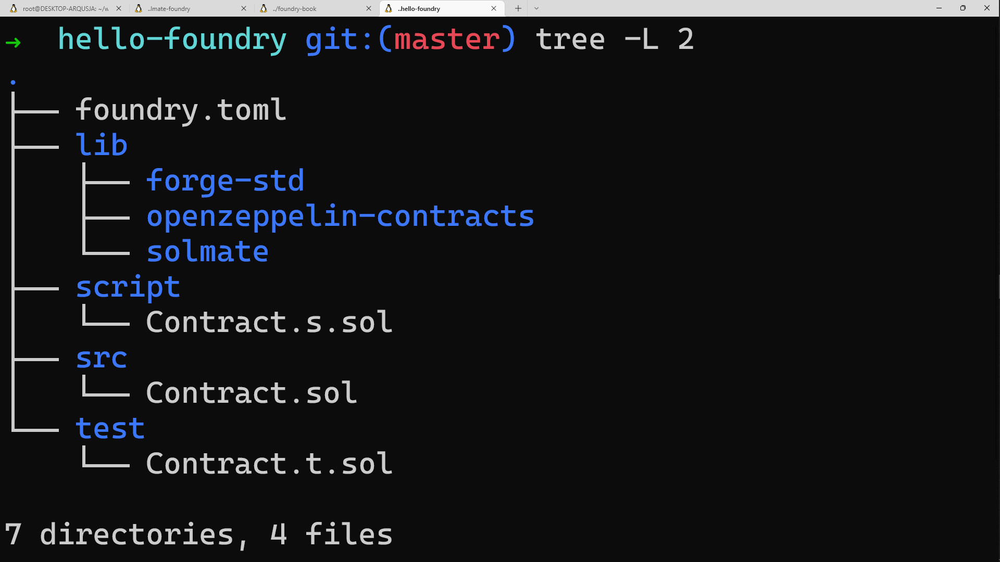
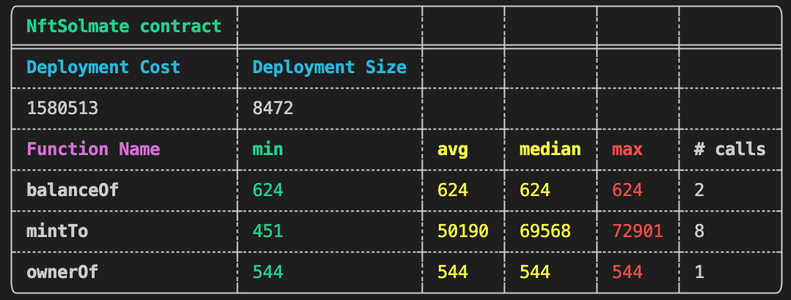
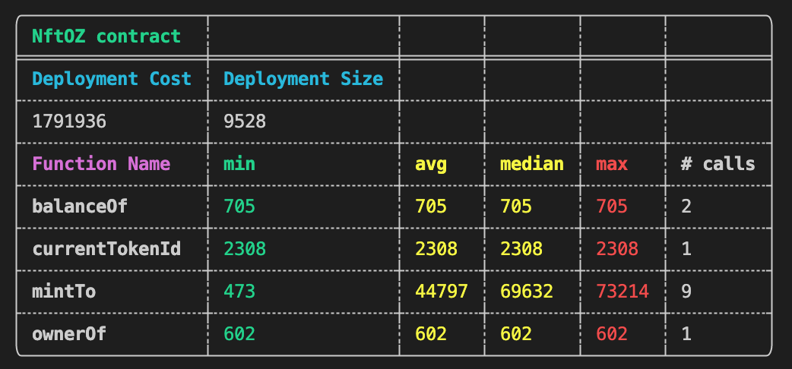

## Creating an NFT with Solmate

This tutorial will walk you through creating an OpenSea compatible NFT with Foundry and [Solmate](https://github.com/transmissions11/solmate/blob/main/src/tokens/ERC721.sol). A full implementation of this tutorial can be found [here](https://github.com/FredCoen/nft-tutorial).

##### This tutorial is for illustrative purposes only and provided on an as-is basis. The tutorial is not audited nor fully tested. No code in this tutorial should be used in a production environment.

### Create project and install dependencies

Start by setting up a Foundry project following the steps outlined in the [Getting started section](../getting-started/installation.html). We will also install Solmate for their ERC721 implementation, as well as some OpenZeppelin utility libraries. Install the dependencies by running the following commands from the root of your project:

```bash
forge install transmissions11/solmate Openzeppelin/openzeppelin-contracts
```

These dependencies will be added as git submodules to your project.

If you have followed the instructions correctly your project should be structured like this:



### Implement a basic NFT

We are then going to rename the boilerplate contract in `src/Contract.sol` to `src/NFT.sol` and replace the code:

```solidity
// SPDX-License-Identifier: UNLICENSED
pragma solidity 0.8.10;

import "solmate/tokens/ERC721.sol";
import "openzeppelin-contracts/contracts/utils/Strings.sol";

contract NFT is ERC721 {
    uint256 public currentTokenId;

    constructor(
        string memory _name,
        string memory _symbol
    ) ERC721(_name, _symbol) {}

    function mintTo(address recipient) public payable returns (uint256) {
        uint256 newItemId = ++currentTokenId;
        _safeMint(recipient, newItemId);
        return newItemId;
    }

    function tokenURI(uint256 id) public view virtual override returns (string memory) {
        return Strings.toString(id);
    }
}
```

Let's take a look at this very basic implementation of an NFT. We start by importing two contracts from our git submodules. We import solmate's gas optimized implementation of the ERC721 standard which our NFT contract will inherit from. Our constructor takes the `_name` and `_symbol` arguments for our NFT and passes them on to the constructor of the parent ERC721 implementation. Lastly we implement the `mintTo` function which allows anyone to mint an NFT. This function increments the `currentTokenId` and makes use of the `_safeMint` function of our parent contract.

### Compile & deploy with forge

To compile the NFT contract run `forge build`. You might experience a build failure due to wrong mapping:

```text
Error:
Compiler run failed
error[6275]: ParserError: Source "lib/openzeppelin-contracts/contracts/contracts/utils/Strings.sol" not found: File not found. Searched the following locations: "/PATH/TO/REPO".
 --> src/NFT.sol:5:1:
  |
5 | import "openzeppelin-contracts/contracts/utils/Strings.sol";
  | ^^^^^^^^^^^^^^^^^^^^^^^^^^^^^^^^^^^^^^^^^^^^^^^^^^^^^^^^^^^^
```

this can be fixed by setting up the correct remapping. Create a file `remappings.txt` in your project and add the line

```text
openzeppelin-contracts/=lib/openzeppelin-contracts/
```

(You can find out more on remappings in [the dependecies documentation](../projects/dependencies.md).

By default the compiler output will be in the `out` directory. To deploy our compiled contract with Forge we have to set environment variables for the RPC endpoint and the private key we want to use to deploy.

Set your environment variables by running:

```bash
export RPC_URL=<Your RPC endpoint>
export PRIVATE_KEY=<Your wallets private key>
```

Once set, you can deploy your NFT with Forge by running the below command while adding the relevant constructor arguments to the NFT contract:

```bash
forge create NFT --rpc-url=$RPC_URL --private-key=$PRIVATE_KEY --constructor-args <name> <symbol>
```

If successfully deployed, you will see the deploying wallet's address, the contract's address as well as the transaction hash printed to your terminal.

### Minting NFTs from your contract

Calling functions on your NFT contract is made simple with Cast, Foundry's command-line tool for interacting with smart contracts, sending transactions, and getting chain data. Let's have a look at how we can use it to mint NFTs from our NFT contract.

Given that you already set your RPC and private key env variables during deployment, mint an NFT from your contract by
running:

```bash
cast send --rpc-url=$RPC_URL <contractAddress>  "mintTo(address)" <arg> --private-key=$PRIVATE_KEY
```

Well done! You just minted your first NFT from your contract. You can sanity check the owner of the NFT with `currentTokenId` equal to **1** by running the below `cast call` command. The address you provided above should be returned as the owner.

```bash
cast call --rpc-url=$RPC_URL --private-key=$PRIVATE_KEY <contractAddress> "ownerOf(uint256)" 1
```

### Extending our NFT contract functionality and testing

Let's extend our NFT by adding metadata to represent the content of our NFTs, as well as set a minting price, a maximum supply and the possibility to withdraw the collected proceeds from minting. To follow along you can replace your current NFT contract with the code snippet below:

```solidity
// SPDX-License-Identifier: UNLICENSED
pragma solidity >=0.8.10;

import "solmate/tokens/ERC721.sol";
import "openzeppelin-contracts/contracts/utils/Strings.sol";
import "openzeppelin-contracts/contracts/access/Ownable.sol";

error MintPriceNotPaid();
error MaxSupply();
error NonExistentTokenURI();
error WithdrawTransfer();

contract NFT is ERC721, Ownable {

    using Strings for uint256;
    string public baseURI;
    uint256 public currentTokenId;
    uint256 public constant TOTAL_SUPPLY = 10_000;
    uint256 public constant MINT_PRICE = 0.08 ether;

    constructor(
        string memory _name,
        string memory _symbol,
        string memory _baseURI
    ) ERC721(_name, _symbol) {
        baseURI = _baseURI;
    }

    function mintTo(address recipient) public payable returns (uint256) {
        if (msg.value != MINT_PRICE) {
            revert MintPriceNotPaid();
        }
        uint256 newTokenId = ++currentTokenId;
        if (newTokenId > TOTAL_SUPPLY) {
            revert MaxSupply();
        }
        _safeMint(recipient, newTokenId);
        return newTokenId;
    }

    function tokenURI(uint256 tokenId)
        public
        view
        virtual
        override
        returns (string memory)
    {
        if (ownerOf(tokenId) == address(0)) {
            revert NonExistentTokenURI();
        }
        return
            bytes(baseURI).length > 0
                ? string(abi.encodePacked(baseURI, tokenId.toString()))
                : "";
    }

    function withdrawPayments(address payable payee) external onlyOwner {
        uint256 balance = address(this).balance;
        (bool transferTx, ) = payee.call{value: balance}("");
        if (!transferTx) {
            revert WithdrawTransfer();
        }
    }
}
```

Among other things, we have added metadata that can be queried from any front-end application like OpenSea, by calling the `tokenURI` method on our NFT contract.

> **Note**: If you want to provide a real URL to the constructor at deployment, and host the metadata of this NFT contract please follow the steps outlined [here](https://docs.opensea.io/docs/part-3-adding-metadata-and-payments-to-your-contract#intro-to-nft-metadata).

Let's test some of this added functionality to make sure it works as intended. Foundry offers an extremely fast EVM native testing framework through Forge.

Within your test folder rename the current `Contract.t.sol` test file to `NFT.t.sol`. This file will contain all tests regarding the NFT's `mintTo` method. Next, replace the existing boilerplate code with the below:

```solidity
// SPDX-License-Identifier: UNLICENSED
pragma solidity 0.8.10;

import "forge-std/Test.sol";
import "../src/NFT.sol";

contract NFTTest is Test {
    using stdStorage for StdStorage;

    NFT private nft;

    function setUp() public {
        // Deploy NFT contract
        nft = new NFT("NFT_tutorial", "TUT", "baseUri");
    }

    function testFailNoMintPricePaid() public {
        nft.mintTo(address(1));
    }

    function testMintPricePaid() public {
        nft.mintTo{value: 0.08 ether}(address(1));
    }

    function testFailMaxSupplyReached() public {
        uint256 slot = stdstore
            .target(address(nft))
            .sig("currentTokenId()")
            .find();
        bytes32 loc = bytes32(slot);
        bytes32 mockedCurrentTokenId = bytes32(abi.encode(10000));
        vm.store(address(nft), loc, mockedCurrentTokenId);
        nft.mintTo{value: 0.08 ether}(address(1));
    }

    function testFailMintToZeroAddress() public {
        nft.mintTo{value: 0.08 ether}(address(0));
    }

    function testNewMintOwnerRegistered() public {
        nft.mintTo{value: 0.08 ether}(address(1));
        uint256 slotOfNewOwner = stdstore
            .target(address(nft))
            .sig(nft.ownerOf.selector)
            .with_key(1)
            .find();

        uint160 ownerOfTokenIdOne = uint160(
            uint256(
                (vm.load(address(nft), bytes32(abi.encode(slotOfNewOwner))))
            )
        );
        assertEq(address(ownerOfTokenIdOne), address(1));
    }

    function testBalanceIncremented() public {
        nft.mintTo{value: 0.08 ether}(address(1));
        uint256 slotBalance = stdstore
            .target(address(nft))
            .sig(nft.balanceOf.selector)
            .with_key(address(1))
            .find();

        uint256 balanceFirstMint = uint256(
            vm.load(address(nft), bytes32(slotBalance))
        );
        assertEq(balanceFirstMint, 1);

        nft.mintTo{value: 0.08 ether}(address(1));
        uint256 balanceSecondMint = uint256(
            vm.load(address(nft), bytes32(slotBalance))
        );
        assertEq(balanceSecondMint, 2);
    }

    function testSafeContractReceiver() public {
        Receiver receiver = new Receiver();
        nft.mintTo{value: 0.08 ether}(address(receiver));
        uint256 slotBalance = stdstore
            .target(address(nft))
            .sig(nft.balanceOf.selector)
            .with_key(address(receiver))
            .find();

        uint256 balance = uint256(vm.load(address(nft), bytes32(slotBalance)));
        assertEq(balance, 1);
    }

    function testFailUnSafeContractReceiver() public {
        vm.etch(address(1), bytes("mock code"));
        nft.mintTo{value: 0.08 ether}(address(1));
    }

    function testWithdrawalWorksAsOwner() public {
        // Mint an NFT, sending eth to the contract
        Receiver receiver = new Receiver();
        address payable payee = payable(address(0x1337));
        uint256 priorPayeeBalance = payee.balance;
        nft.mintTo{value: nft.MINT_PRICE()}(address(receiver));
        // Check that the balance of the contract is correct
        assertEq(address(nft).balance, nft.MINT_PRICE());
        uint256 nftBalance = address(nft).balance;
        // Withdraw the balance and assert it was transferred
        nft.withdrawPayments(payee);
        assertEq(payee.balance, priorPayeeBalance + nftBalance);
    }

    function testWithdrawalFailsAsNotOwner() public {
        // Mint an NFT, sending eth to the contract
        Receiver receiver = new Receiver();
        nft.mintTo{value: nft.MINT_PRICE()}(address(receiver));
        // Check that the balance of the contract is correct
        assertEq(address(nft).balance, nft.MINT_PRICE());
        // Confirm that a non-owner cannot withdraw
        vm.expectRevert("Ownable: caller is not the owner");
        vm.startPrank(address(0xd3ad));
        nft.withdrawPayments(payable(address(0xd3ad)));
        vm.stopPrank();
    }
}

contract Receiver is ERC721TokenReceiver {
    function onERC721Received(
        address operator,
        address from,
        uint256 id,
        bytes calldata data
    ) external override returns (bytes4) {
        return this.onERC721Received.selector;
    }
}

```

The test suite is set up as a contract with a `setUp` method which runs before every individual test.

As you can see, Forge offers a number of [cheatcodes](../cheatcodes/) to manipulate state to accommodate your testing scenario.

For example, our `testFailMaxSupplyReached` test checks that an attempt to mint fails when the max supply of NFT is reached. Thus, the `currentTokenId` of the NFT contract needs to be set to the max supply by using the store cheatcode which allows you to write data to your contracts storage slots. The storage slots you wish to write to can easily be found using the
[`forge-std`](https://github.com/foundry-rs/forge-std/) helper library. You can run the test with the following command:

```bash
forge test
```

If you want to put your Forge skills to practice, write tests for the remaining methods of our NFT contract. Feel free to PR them to [nft-tutorial](https://github.com/FredCoen/nft-tutorial), where you will find the full implementation of this tutorial.

### Gas reports for your function calls

Foundry provides comprehensive gas reports about your contracts. For every function called within your tests, it returns the minimum, average, median and max gas cost. To print the gas report simply run:

```bash
forge test --gas-report
```

This comes in handy when looking at various gas optimizations within your contracts.

Let's have a look at the gas savings we made by substituting OpenZeppelin with Solmate for our ERC721 implementation. You can find the NFT implementation using both libraries [here](https://github.com/FredCoen/nft-tutorial). Below are the resulting gas reports when running `forge test --gas-report` on that repository.

As you can see, our implementation using Solmate saves around 500 gas on a successful mint (the max gas cost of the `mintTo` function calls).





That's it, I hope this will give you a good practical basis of how to get started with foundry. We think there is no better way to deeply understand solidity than writing your tests in solidity. You will also experience less context switching between javascript and solidity. Happy coding!

> Note: Follow [this](./solidity-scripting.md) tutorial to learn how to deploy the NFT contract used here with solidity scripting.
