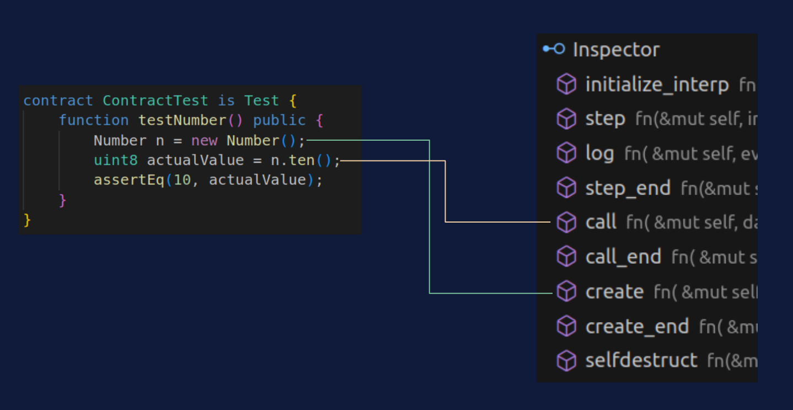
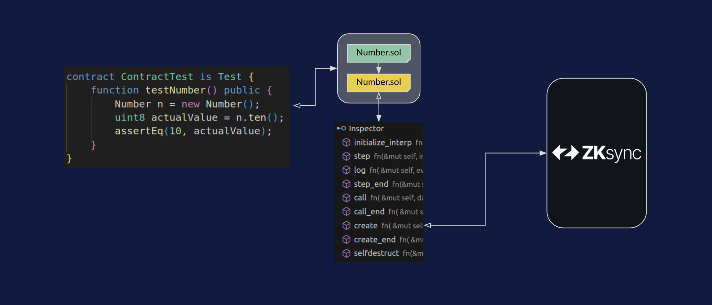

# ZKSync Specifics

This section covers the specific parts of ZKSync foundry, how it works, insight into compilation, and custom cheatcodes to help work with contracts specifically in ZKSync.

## To-start Context
Foundry-zkSync tests are initially [executed](execution-overview.md) in the EVM context (the traditional execution environment for Ethereum smart contracts). This is done to maintain compatibility with Ethereum tooling and to leverage Foundry features like [Cheatcodes](limitations/cheatcodes.md).

### Lifetime Execution
A forge test begins execution in the EVM context but can switch to the EraVM context during the test for zkSync-specific features. Selecting the EraVM context ensures all calls and deployments are executed within zkSync.
There are mainly three steps

**Step 1)** Aggregate: [Dual compiling](compilation-overview.md) contracts 

**Step 2)** Intercept: Overriding `CALL`s and `CREATE`s (see [limitations](limitations/README.md) for more details)

**Step 3)**: Assimilate: One-shot zkEVM execution (see [Standard Library](forge-zksync-std.md) for more details)

### Additional Information.
It is essential before deep diving in to the details of how to run the tool. You significantly understand how [ZKsync](https://docs.zksync.io/) works.

Don't hesitate to ask if you have specific questions regarding the tool or feature requests.

### Having issues?

If you have issues with the tool or don't know where to start, we strongly suggest you look at our [repo](https://github.com/matter-labs/foundry-zksync) and [closed issues](https://github.com/matter-labs/foundry-zksync/issues?q=is%3Aissue+is%3Aclosed), where we usually get deep dive into implementation details.
